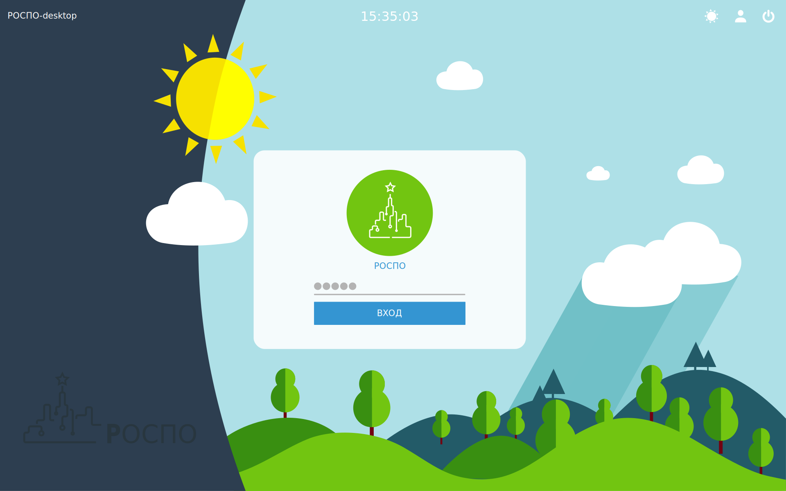

sddm-theme-neru-rospo
===============

Вход в систему SDDM-Неру-РОСПО 
Основные значения настраиваются в файле theme.conf.

## Изображение (может немного отличатся от оригинала)

## Особенности

* Выбор пользователя через меню
* Выбор пользователя, набрав имя пользователя (необязательно)
* Установка логотипа организации вместо значка пользователя (необязательно)
* Выбор фонового изображения (в параметрах конфигурации)
* Настраиваемая цветовая схема (опция конфигурации)
* Установка сеанса по умолчанию (параметр конфигурации)
* Выбор предпочтительного сеанса через меню
* Выбер сеанса пользователя по запросу в ваш API (необязательно, см. ниже)
* Отобразить настраиваемое сообщение об использовании для пользователя (необязательно)

## Установка

1. Установите sddm
2. `git clone https://github.com/chistota/sddm-theme-neru-rospo.git /usr/share/sddm/themes/sddm-theme-neru-rospo`
3. `chmod -R 755 /usr/share/sddm/themes/sddm-theme-neru-rospo`
4. Усчтановите qml зависимости (qt5-graphicaleffects и qt5-quickcontrols2)
5. Положите "Current=rospo-sddm-theme" в газдел /etc/sddm.conf

## Назначения файлов конфигурации

Вы можете создать файл `theme.conf.user` в папке темы, который переопределит
по умолчанию.

* `default_background`: Фоновое изображение
* `default_session`: Имя сеанса по умолчанию.  Имя сеанса `sessionname` в 
  `/usr/share/xsessions/sessionname.desktop` (подставьте нужное значение `cinnamon`, `cinnamon2d` или без `Cinnamon (в зависимости от рабочего окружения)`)
* `accent1`: Цвет верхнего меню
* `accent2`: Цвет ввода пароля и кнопки входа
* `accent2_hover`: цвет, который будет применяться при наведении на элементы accent2
* `logo` (по желанию): путь к изображению логотипа
* `user_name`: `fill``fill`, чтобы ввести свое собственное имя пользователя или `select` если вы хотите предоставить меню пользователей на выбор системы
* `session_api` (по желанию): URL-адрес, который будет возвращать предпочтительный пользователь (да, это было сделано с очень конкретным прецедентом в ум, см. ниже)
* `aup` (по желанию): Строка, которая будет содержать допустимую политику использования для ваших пользователей. Символы Escape, такие как '\ n', будут отображаться правильно (т. Е. Как
   фактические строки перевода). В качестве альтернативы, процитировать все это и положить в реальность переводы строк.

### API сеанс

Значение API сеанса полезно, если, например, вы используете лабораторию linux
многие пользователи и пользователи могут выбрать среду рабочего стола, которая будет связана с
их счет. Например, это можно сделать через LDAP и небольшой веб-API.

Тема greeter будет читать ваше значение `session_api` из файла конфигурации, замените `% s` на имя пользователя, выполните запрос HTTP` GET` и используйте
тело результата как имя сеанса. Опять же, имя сеанса должно быть
`sessionname` в` / usr / share / xsessions / sessionname.desktop` (т. е. `cinnamon` или
`cinnamon2d`, NOT` Cinnamon (Software Rendering) `). Если API возвращает `N`,
то он будет сброшен до значения конфигурации `default_session`.

Например, если ваш `session_api` является` http: // ldap-api.mylab.com /% s / session / 0`
и пользователь вводит их имя `m_wynn` в поле имени пользователя, как только они
фокус от поля имени пользователя, тема будет `GET`
`HTTP: // ldap-api.mylab.com / m_wynn / сессия / 0`. Если результатом является «N»,
Будет использоваться `default_session`. В противном случае тело ответа (т.
«корицей») используется как имя сеанса.

